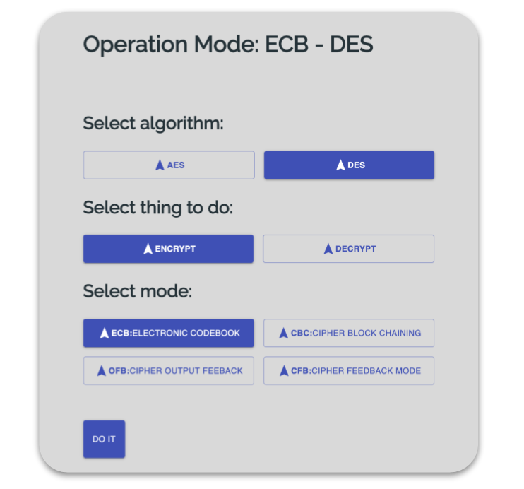

# ThingsWithCryptography
Projects I did while learning about cryptography

## Hybrid app

A webapp with different kind of services, like confidentiality, authentically or both for messages (inspired in PGP), 
that we (I and a friend Oscar David) developed. The application encrypts with AES and RSA with the digital
signature.

[Show me the code](Code/HybridApp)

<a href="Code/HybridApp">
  
   
  
   
</a>

This is a diagram of the source:

## Binary field

A C++ class that let you store finite field elements, specially GF(2^8), like the one used in AES.

[Show me the code](Code/AES/BinaryField.cpp)

## Operation modes

A webapp that allowed you to upload a photo and see how differents modes of operations
(using AES and DES) affected the encoded information".

[Show me the code](Code/OperationModes)

## Lenstra algorithm

This an implementation of lenstra's algorithm, and uses eliptic curves to
factor integers.

[Show me the code](Code/Lenstra)

## Hill cipher
[Show me the code](Code/Hill)

## PollardsRho cipher
[Show me the code](Code/PollardsRho)

## Affine cipher
[Show me the code](Code/Affine)

## RSA cipher
[Show me the code](Code/RSA)
